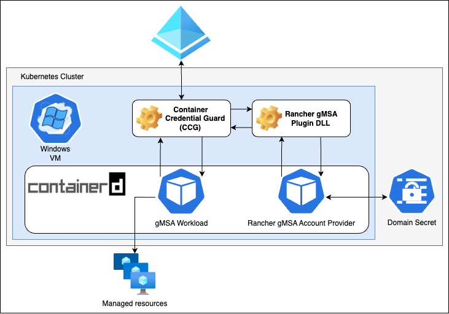

Container Credential Guard Rancher Kubernetes Cluster Plugin (CCGRKC Plugin)
========
##### Current Status: **Experimental**

The Container Credential Guard Rancher Kubernetes Cluster Plugin (CCGRKC Plugin) retrieves group managed service account (gMSA) credentials stored on a Kubernetes cluster to facilitate the domain-joined process.

## Requirements

On a domain controller, a gMSA for the container and a standard user account that is used to retrieve the gMSA password needs to be created. These credentials need to be stored on the Kubernetes cluster as a Secret.

## Who needs this CCG Plugin?

Anyone who adds Windows hosts onto Kubernetes clusters who would like to schedule workloads that utilize gMSAs to communicate with Active Directory.

By using this plugin, all your Windows hosts will be able to access a standard users account's credentials, which will allow the underlying container runtime on your Windows hosts to inject gMSA credentials into your pods.

These gMSA credentials can be used in a multitude of ways, including using them to offload user authentication for your applications to Active Directory (which is useful for **internal** applications that need to authenticate users within an organization that is managed via Active Directory).

## How is this different from [`microsoft/Azure-Key-Vault-Plugin-gMSA`](https://github.com/microsoft/Azure-Key-Vault-Plugin-gMSA)?

[`microsoft/Azure-Key-Vault-Plugin-gMSA` (CCGAKV)](https://github.com/microsoft/Azure-Key-Vault-Plugin-gMSA) is intended to be used on clusters that use [Azure Kubernetes Service (AKS)](https://learn.microsoft.com/en-us/azure/aks/intro-kubernetes) or at least have hosts that are provisioned and hosted on Azure.

It relies on each host being configured with an [Azure Managed Identity](https://learn.microsoft.com/en-us/azure/active-directory/managed-identities-azure-resources/overview) so that the host can be trusted to retrieve domain credentials from [Azure Key Vault](https://learn.microsoft.com/en-us/azure/key-vault/general/basic-concepts).

If you are looking for a way to deploy gMSA workloads on AKS or Azure, it might be more convenient to use the official CCGAKV plugin which comes preinstalled onto all Windows nodes.

However, if you are looking for a way to deploy gMSA workloads in a **Kubernetes-native** way (with no dependency on an infrastructure provider), this is a good solution to use.

## How does the plugin work?

On a high-level, all CCG Plugins take the following steps on a container being scheduled onto the host:

1. `ccg.exe` (Container Credential Guard) is invoked by your container runtime (i.e. `containerd`) when a container that provides a "credential spec" for Windows is created

2. `ccg.exe` invokes the CCG Plugin (installed as a [DLL (Dynamic Link Library)](https://learn.microsoft.com/en-us/troubleshoot/windows-client/deployment/dynamic-link-library)) and passes in inputs from the "credential spec'

3. The CCG Plugin retrieves connection details (i.e. an access token or some other credentials) and executes a request to a "secret store" (like Azure Key Vault) to get back Active Directory credentials tied to the standard user account

4. `ccg.exe` retrieves the standard user account's credentials and uses it to retrieve the gMSA's credentials from Active Directory that corresponds to what was provided in the "credential spec"

5. The container runtime injects the credentials from `ccg.exe` into the container, which allows the application to use it

The Rancher plugin follows the same process as above by storing the connection details in **Kubernetes secrets** that the CCG Plugin has access to via an **Account Provider API**, which runs as a `HostProcess` on each Windows host and represents the "secret store".

## Getting Started

For more information, see the [Getting Started guide](docs/gettingstarted.md).

## Developing

### Which branch do I make changes on?

This repository is built and released off the contents of the `main` branch. To make a contribution, open up a PR to the `main` branch.

## License
Copyright (c) 2023 [Rancher Labs, Inc.](http://rancher.com)

Licensed under the Apache License, Version 2.0 (the "License");
you may not use this file except in compliance with the License.
You may obtain a copy of the License at

[http://www.apache.org/licenses/LICENSE-2.0](http://www.apache.org/licenses/LICENSE-2.0)

Unless required by applicable law or agreed to in writing, software
distributed under the License is distributed on an "AS IS" BASIS,
WITHOUT WARRANTIES OR CONDITIONS OF ANY KIND, either express or implied.
See the License for the specific language governing permissions and
limitations under the License.
