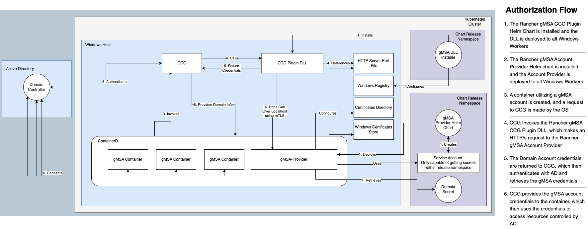

# Testing Rancher-Plugin-gMSA 

## High Level Design

The below diagram depicts a high level visualization of the project and how the components interact with each other and the Windows OS.

### Prerequisite Reading 
The Rancher-Plugin-gMSA project, while simple in design, requires some technical knowledge of the Windows operating system and Active Directory. Before diving into any testing or troubleshooting, it's recommended to review at least the following documentation to get up to speed. 

> More detailed documentation can be found in the [rancher/windows](https://github.com/rancher/windows) repository, however the below is a good overview of the high level concepts this project focuses on.

+ Windows Registry
  + https://learn.microsoft.com/en-us/windows/win32/sysinfo/structure-of-the-registry
+ Windows Active Directory 
  + https://learn.microsoft.com/en-us/windows-server/identity/ad-ds/get-started/virtual-dc/active-directory-domain-services-overview
+ Active Directory gMSA Accounts
  + https://learn.microsoft.com/en-us/windows-server/security/group-managed-service-accounts/group-managed-service-accounts-overview
+ Dynamic Link Libraries 
  + https://learn.microsoft.com/en-us/troubleshoot/windows-client/deployment/dynamic-link-library
+ Container Credential Guard
  + https://learn.microsoft.com/en-us/windows/win32/api/ccgplugins/nn-ccgplugins-iccgdomainauthcredentials (Developer documentation, but provides a brief overview of what CCG is)

### Core Components 
The Rancher gMSA Plugin project builds off of the existing Rancher gMSA web-hook feature, and consists of three new components

1. The `rancher-ccg-plugin-installer`, responsible for installing, uninstalling, and upgrading the CCG plugin DLL. The plugin installer is expected to be deployed onto all Windows hosts and is considered a one-shot operation.
   1. More detailed design documentation and testing procedures for the `rancher-ccg-plugin-installer` can be found [here](./plugin-installer/README.md)
2. The `rancher-gmsa-account-provider`, responsible for providing an HTTP/s API which can be queried by the Rancher CCG plugin. Its core responsibility is to retrieve the contents of Kubernetes secrets containing Active Directory Domain login information.
   1. More detailed design documentation and testing procedures for the `rancher-gmsa-account-provider` can be found [here](./account-provider/README.md)
3. The Microsoft Container Credential Guard (CCG). CCG is an application developed by Microsoft and installed on all Windows 2019 and Windows 2022 server instances when the Containers feature is enabled. It's sole responsibility is to facilitate the authentication process for non-domain joined nodes using gMSA accounts.

When developing, you must run through the test cases listed [here](./developer-smoke-test-cases.md) to ensure your changes have not resulted in a regression or bug. 
